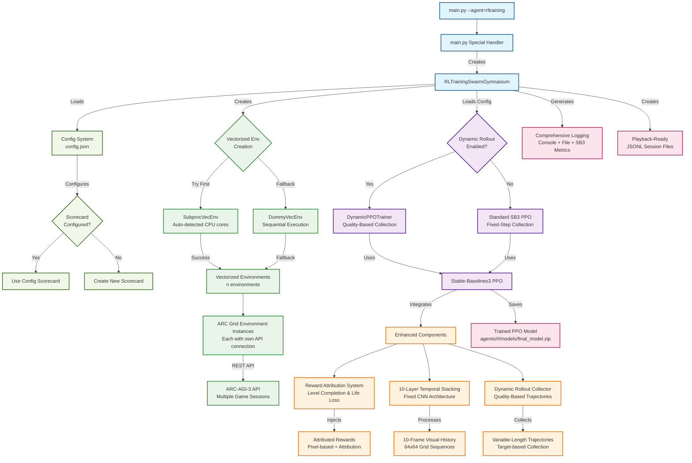
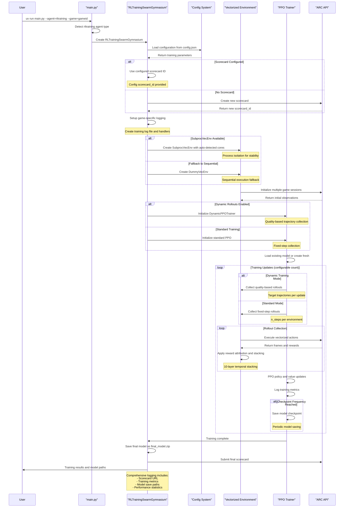
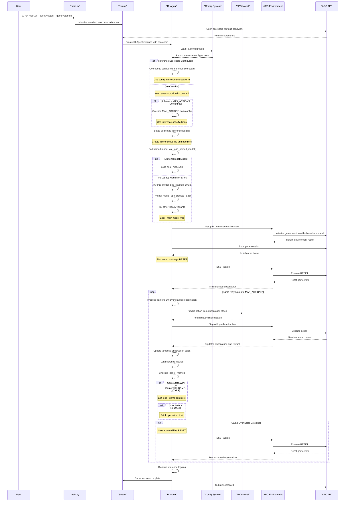

# Reinforcement Learning for ARC-AGI-3

## Overview

The RL agent leverages deep reinforcement learning to learn ARC-AGI-3 puzzle-solving through direct game interaction, building on the existing swarm infrastructure to test scalable training and evaluation.

### Goals

- **Utilize existing swarm infrastructure**: Orchestrate RL learning and playing games through the swarm system
- **Exhibit minimal signs of learning**: Demonstrate measurable improvement in puzzle-solving performance over time ([see training results](agents/rl/TRAINING_RESULTS.md))

### Features

- **Swarm integration**: Built on swarm infrastructure using standard `uv run main.py` execution flow
- **Minimal engineering**: RL agent learns purely from game interaction without hardcoded puzzle-solving priors
- **Reward attribution**: A reward system that attributes rewards to specific actions for better learning signals
- **Dynamic rollout**: Quality-based rollout collection that focuses training on meaningful game experiences
- **SubprocVecEnv integration**: Parallel environment execution with automatic fallback support for optimal CPU/GPU utilization
- **Temporal stacking**: 10-layer CNN architecture with comprehensive temporal history tracking for visual pattern learning

### RL-Swarm Integration Architecture

---

## Setup and Usage

### Environment Setup

```bash
# Clone repository and navigate to project
cd ARC-AGI-3-Agents

# Copy environment configuration
cp .env-example .env
# Edit .env and set your ARC_API_KEY

# Install uv if it's not already installed
curl -LsSf https://astral.sh/uv/install.sh | sh

# Install dependencies with RL training support
uv sync --active
```

### Training

```bash
# Train RL agent on a specific game (creates new scorecard automatically)
uv run main.py --agent=rltraining --game=ls20

# Train with custom tags for experiment tracking
uv run main.py --agent=rltraining --game=ls20 --tags="experiment,baseline"

# Monitor training progress (includes scorecard URL for web monitoring)
tail -f agents/rl/logs/training_ls20.log
```
### Inference

Run trained RL models using the swarm infrastructure:

```bash
# Run trained RL agent on a specific game (uses swarm-created scorecard by default)
uv run main.py --agent=rlagent --game=ls20

# Run with custom tags for tracking
uv run main.py --agent=rlagent --game=ls20 --tags="inference,evaluation"

# Monitor inference progress (includes scorecard URL for web monitoring)
tail -f agents/rl/logs/inference_ls20.log
```

**Scorecard Configuration for Inference:**
The same `scorecard_id` configuration applies to inference:

- **Empty string** (default): Uses swarm-created scorecard
- **Non-empty string**: Uses the specified scorecard ID for inference
- **URL logging**: Both cases log the scorecard URL to the inference log file

The RLAgent automatically:
- Loads the trained model (`final_model.zip`) for the specified game
- Uses 10-layer temporal stacking for observations
- Makes deterministic predictions for consistent behavior
- Integrates with the standard swarm system (scorecard, recording, etc.)
- Logs scorecard URL to dedicated inference log file

### Configuration

Key training parameters can be adjusted in `agents/rl/config.json`:

```json
{
  "training": {
    "max_actions": 200,
    "num_updates": 20,
    "scorecard_id": ""
  },
  "dynamic_rollout": {
    "enabled": true,
    "target_trajectories_per_update": 4,
    "max_rollout_steps": 1000
  },
  "representation": {
    "num_residual_blocks": 10,
    "filters": 256,
    "kernel_size": 3,
    "use_batch_norm": true
  }
}
```

**Training Configuration:**
- `scorecard_id`: Existing scorecard ID to use for both training and inference (empty string = auto-create new scorecard)
- `max_actions`: Maximum actions per training episode
- `num_updates`: Number of PPO training updates to perform

**Dynamic Rollout Configuration:**
- `target_trajectories_per_update`: Number of trajectories to collect per PPO update (default: 4)
- `max_rollout_steps`: Safety limit to prevent infinite rollout collection (default: 1000)

**Neural Network Architecture:**
- `num_residual_blocks`: Network depth (adjustable, default: 10)
- `filters`: Network width (adjustable, default: 256)  
- `kernel_size`: Convolution size (adjustable, default: 3)
- `use_batch_norm`: Batch normalization (adjustable, default: true)

**Scorecard URL Logging:**
Both training and inference sessions automatically log the scorecard URL to their respective log files:
- **Training**: `./agents/rl/logs/training_{game}.log`
- **Inference**: `./agents/rl/logs/inference_{game}.log`

The logged URL provides direct access to the web interface for monitoring session progress and results.

### Scorecard Management

By default, RL training creates a new scorecard for each training session. You can optionally specify an existing scorecard ID to use for training:

**Using Existing Scorecard:**
```json
{
  "training": {
    "scorecard_id": "your-existing-scorecard-id"
  }
}
```

**Benefits of Using Existing Scorecards:**
- **Continue experiments**: Resume training with the same scorecard for consistency
- **Compare runs**: Multiple training runs can share the same scorecard for comparison
- **Track progress**: Maintain continuous tracking across training sessions

**Important Notes:**
- Empty string (default): Creates new scorecard automatically
- Non-empty string: Uses the provided scorecard ID
- Training completion will properly close the scorecard regardless of source
- Environment instances will share the same scorecard during training

#### Inference Scorecard Management

The same scorecard configuration also applies to RL inference. When running the trained RL agent, it will check the config for a scorecard ID preference:

**Inference with Existing Scorecard:**
```json
{
  "training": {
    "scorecard_id": "experiment-001-shared"
  }
}
```

**Example Workflows:**

**Experiment Continuity:**
```bash
# 1. Train with specific scorecard
# config.json: {"training": {"scorecard_id": "exp-001"}}
uv run main.py --agent=rltraining --game=ls20

# 2. Run inference with same scorecard (same config)
uv run main.py --agent=rlagent --game=ls20
# -> Uses same scorecard for direct training vs inference comparison
```

**A/B Testing:**
```bash
# Run multiple inference sessions with same scorecard
uv run main.py --agent=rlagent --game=ls20 --tags="inference,test1"
uv run main.py --agent=rlagent --game=ls20 --tags="inference,test2"
# -> All runs share the configured scorecard for easy comparison
```

**Benefits for Inference:**
- **Training-Inference Consistency**: Use same scorecard for training and inference runs
- **Performance Tracking**: Compare training vs inference metrics on shared scorecard
- **Production Inference**: Use specific scorecard IDs for production monitoring
- **Experiment Organization**: Group related training and inference runs together

**Behavior:**
- Empty `scorecard_id`: RLAgent uses swarm-created scorecard (default behavior)
- Non-empty `scorecard_id`: RLAgent overrides swarm scorecard with configured ID
- Config loading failure: Falls back gracefully to swarm scorecard
- Cleanup works properly regardless of scorecard source

### Hardware Configuration: CPU vs GPU

Our RL system uses **Stable-Baselines3 PPO with SubprocVecEnv**, which according to the [official SB3 documentation](https://stable-baselines3.readthedocs.io/en/master/modules/ppo.html) is **"meant to be run primarily on the CPU"**. GPU usage with vectorized environments is experimental and can encounter memory issues.

#### **🖥️ CPU Training (Recommended)**

**Why CPU is Recommended:**
- **Stable**: SB3 PPO + SubprocVecEnv is designed and optimized for CPU
- **Memory Efficient**: No GPU memory constraints, uses system RAM
- **Parallel Friendly**: SubprocVecEnv leverages all CPU cores effectively
- **Reliable**: Proven stability for long training runs

**Optimal CPU Configuration** (`agents/rl/config.json`):
```json
{
  "training": {
    "device": "cpu",
    "batch_size": 32,
    "n_steps": 64,
    "n_epochs": 5,
    "max_actions": 200,
    "num_updates": 30
  },
  "dynamic_rollout": {
    "target_trajectories_per_update": 3,
    "max_rollout_steps": 300
  }
}
```

**Expected Performance:**
- **Memory Usage**: 2-4 GB RAM
- **Training Speed**: 1-1.5 minutes per update
- **Stability**: High reliability for background training

#### **🚨 GPU Training (Experimental)**

**⚠️ Important Warnings:**
- **Experimental Status**: SB3 documentation states GPU+vectorized environments are not the primary use case
- **Memory Issues**: Can easily exceed GPU memory limits (44+ GB usage observed)
- **Instability**: Higher risk of CUDA OOM errors and training crashes

**If You Must Use GPU** (`agents/rl/config.json`):
```json
{
  "training": {
    "device": "cuda",
    "batch_size": 64,
    "n_steps": 128, 
    "n_epochs": 10,
    "pytorch_cuda_alloc_conf": "expandable_segments:True",
    "max_actions": 300,
    "num_updates": 50
  },
  "dynamic_rollout": {
    "target_trajectories_per_update": 4,
    "max_rollout_steps": 800
  }
}
```

**GPU Memory Management:**
- **Automatic Fallback**: System automatically falls back to CPU if GPU memory insufficient
- **Memory Monitoring**: Training logs GPU memory usage
- **Conservative Settings**: Use smaller batch sizes and fewer parallel environments

#### **Configuration Recommendations**

| Scenario | Device | Batch Size | n_envs | Memory      | Stability |
|----------|--------|------------|--------|-------------|-----------|
| **Laptop Background** | `cpu` | 32 | auto (12) | 32+ GB RAM  | ⭐⭐⭐⭐⭐ |
| **Workstation CPU** | `cpu` | 64 | auto (16-32) | 64+ GB RAM  | ⭐⭐⭐⭐⭐ |
| **GPU Experimental** | `cuda` | 64-128 | 2-4 | 44+ GB VRAM | ⭐⭐⭐ |

#### **Troubleshooting**

**Force CPU Mode:**
```json
{
  "training": {
    "device": "cpu"
  }
}
```

**Common GPU Issues:**
```bash
# CUDA out of memory error
RuntimeError: CUDA out of memory. Tried to allocate X.XX GiB...

# Solution: Switch to CPU or reduce batch_size
```

**Performance Expectations:**
- **CPU Training**: Consistent, reliable, 20-40 minutes for 30 updates
- **GPU Training**: Faster per update but higher failure risk, memory constraints

---

## RL Architecture Overview

### Early-Stage Prototyping Architecture

The current approach prioritizes **stability and integration**, recognizing that early-stage rapid prototyping requires reliable, debuggable components that can integrate well with existing infrastructure.

**Stable-Baselines3 PPO**: We chose SB3's PPO implementation not for its reliability and integration with vectorized Gymnasium environments.

**Gymnasium Environment Interface**: The standardized Gymnasium API provides a **well-defined contract** between our game logic and RL training. This standard interface has been thoroughly tested across diverse environments, reducing integration bugs and providing familiar debugging patterns when issues arise.

**SubprocessVecEnv for Fault Tolerance**: Rather than implementing custom parallel environment management, SubprocessVecEnv provides **process isolation** that prevents individual environment crashes from terminating training. This is crucial for early prototyping when environment logic may still contain edge-case bugs.

### Integration with Existing Infrastructure

**Seamless Swarm Integration**: Our Gymnasium environments implement the standard interface, allowing them to **plug directly into existing swarm orchestration** without requiring modifications to the established agent framework, scorecard management, or recording systems.

**Compatible Logging Infrastructure**: SB3's built-in metrics and logging integrate naturally with our existing log aggregation and monitoring systems, preserving the established debugging and analysis workflows that the team already understands.

**Preserved API Patterns**: The environment wrapper maintains all existing ARC-AGI-3 API interaction patterns, ensuring that network timeouts, authentication, and error handling remain consistent with the broader codebase.

**Minimal Code Surface Area**: By leveraging standard libraries for the core RL loop, we minimize the amount of custom reinforcement learning code that needs to be maintained, debugged, and extended during rapid prototyping iterations.

```
Existing Swarm System
    ↓ (minimal integration changes)
SB3 PPO ←→ SubprocessVecEnv ←→ [Multiple ARCGridEnvironment] ←→ [Existing ARC API]
    ↓ (standard logging interfaces)  
Existing Logging & Monitoring Infrastructure
```

**Risk Mitigation for Prototyping**: This architecture provides **graceful degradation** patterns - if parallel environments fail, the system automatically falls back to sequential execution. If GPU resources are unavailable, training continues on CPU. These fallback mechanisms ensure that prototype development continues even when infrastructure is imperfect.

**Development Velocity Benefits**: Standard interfaces and mature libraries mean faster debugging cycles, familiar error patterns, and extensive community documentation. This reduces the time spent on RL infrastructure debugging and maximizes the time available for tackling ARC-specific visual reasoning challenges.

### Reward Attribution System

The environment automatically attributes rewards to specific actions that caused significant game state changes:

1. **Life Loss Detection**: Identifies when actions cause dramatic negative changes (losing lives)
2. **Movement Tracking**: Rewards actions that lead to productive player movement
3. **Environment Changes**: Detects and rewards actions that beneficially modify the game world

### Dynamic Rollout Collection

Instead of fixed-length episodes, the trainer uses quality-based rollout collection:

1. **Trajectory Quality Scoring**: Each rollout receives a quality score based on meaningful progress
2. **Adaptive Collection**: Continues collecting until target number of high-quality trajectories obtained
3. **Early Termination**: Stops poor-quality trajectories early to focus on valuable experiences


### **Training and Inference Implementation**

### High-Level Components

```
agents/rl/
├── config.json                    # Training configuration
├── rl_training_swarm_gymnasium.py # Main training orchestrator  
├── dynamic_ppo_trainer.py         # Quality-based PPO trainer
├── arc_grid_env.py                # ARC-AGI-3 Gymnasium environment
├── extractors/                    # Neural network feature extractors
│   ├── stacked_cnn_extractor.py   # 10-layer temporal stacking CNN
│   └── registry.py                # Extractor registration system
├── models/                        # Trained model checkpoints
│   └── ls20/                      # Game-specific models
└── logs/                          # Training logs and metrics
    └── training_ls20.log          # Unified training log
```

### Key Modules

- **`rl_training_swarm_gymnasium.py`**: Main training orchestrator that integrates RL training with swarm infrastructure
- **`dynamic_ppo_trainer.py`**: Custom PPO trainer with quality-based rollout collection and dynamic hyperparameter adjustment
- **`arc_grid_env.py`**: Gymnasium environment wrapper that converts ARC-AGI-3 API calls into RL observations and rewards
- **`extractors/stacked_cnn_extractor.py`**: Fixed 10-layer temporal stacking CNN architecture for processing grid sequences
- 
### Training Flow



**Scorecard Configuration:**
To use a specific scorecard ID for training, edit `agents/rl/config.json`:

```json
{
  "training": {
    "scorecard_id": "your-scorecard-id-here"
  }
}
```

- **Empty string** (default): Creates a new scorecard automatically
- **Non-empty string**: Uses the specified scorecard ID for training
- **URL logging**: Both cases log the scorecard URL to the training log file

## Inference Flow



